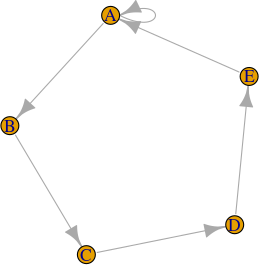
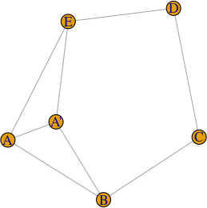

# R package: dupNodes [](https://github.com/JJ/R-dupNodes/actions/workflows/R-stuff.yml)

`dupNodes` is the companion package to paper "Intra-family links in the analysis
of marital networks", with [reference here](inst/REFERENCES.bib).

It creates duplicates of nodes that have self loops such as the one in this graph



in this way



which has exactly the same degree; in this way, the weights of these self-loops
can be taken into account when computing centrality measures such as
betweenness.

## Reference

Please cite this paper when using this package

```bibtex
@Article{mm24:intra_family_links,
  author =       {Merelo, J.J. and Molinari, M.C. },
  title =        {Intra-family links in the analysis of marital networks},
  journal =      {Journal of computational social science},
  year =         2024,
  url= {https://rdcu.be/dwYth},
  doi= {https://doi.org/10.1007/s42001-023-00245-4},
  month =     {January}
}
```

